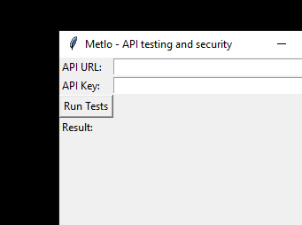
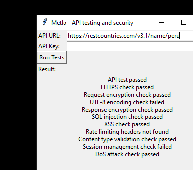

# Metlo - API Testing and Security
Metlo is a simple Python application that allows you to test the security of a web API. It checks for common vulnerabilities and issues, such as SQL injection, cross-site scripting (XSS), rate limiting, and more.

# How to Use
1. Clone this repository to your local machine.
2. Install the required dependencies using pip install -r requirements.txt.
3. Run the application by executing python metlo.py.
4. Enter the API URL and API key in the input fields.
5. Click the "Run Tests" button to start the API test.
6. The result of the test will be displayed in the text area below.

# Dependencies
* requests
* tkinter

# Example Usage
Here's an example of how to use the Metlo application:

# Contributing
* Roshan Jadhav - roshan.lj@somaiya.edu
* Bilal Inamdar - bilal.i@somaiya.edu
* Anannya Khedekar - anannya.khedekar@somaiya.edu
